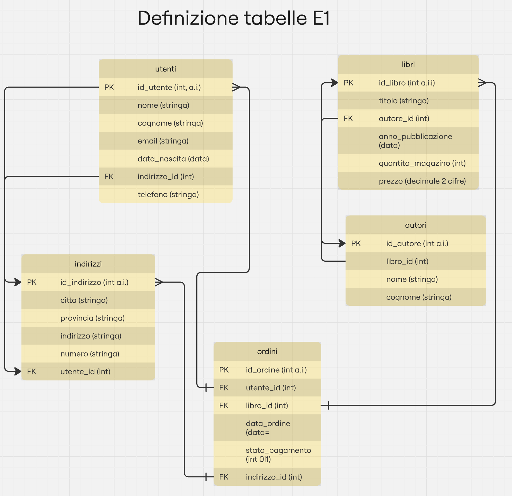
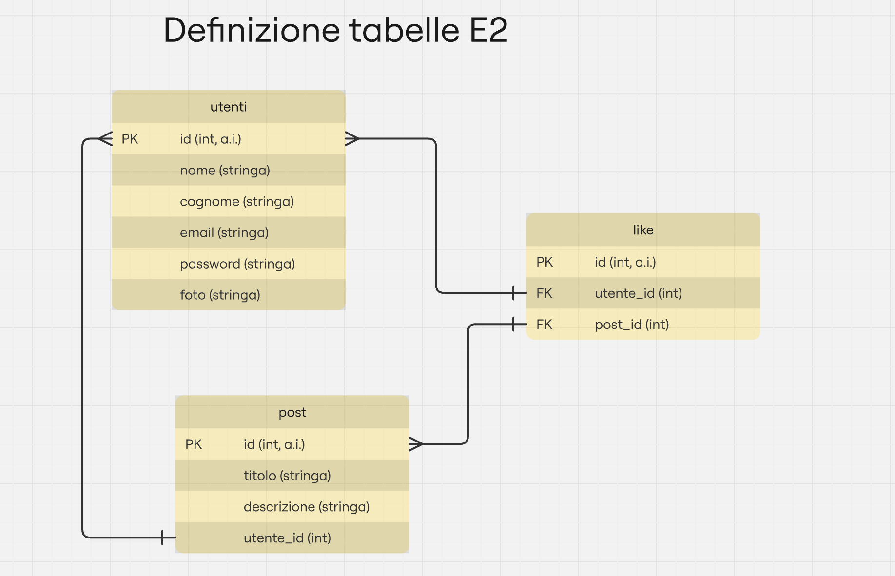
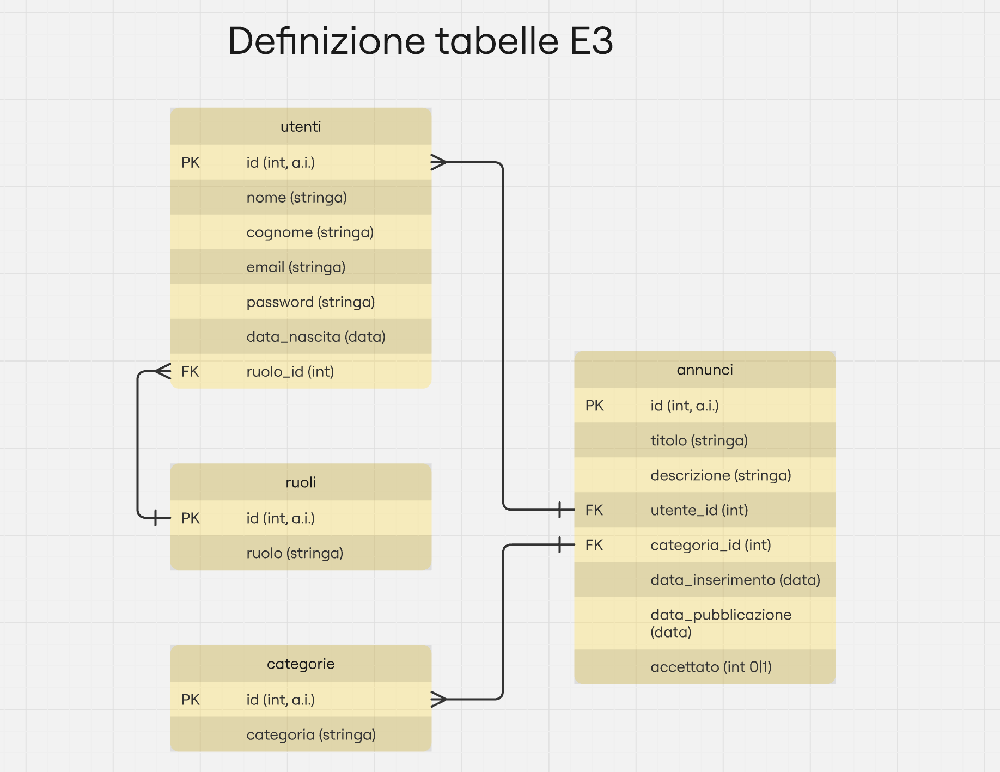

# ############################################################################
# DATABASE - MySQL 
# ############################################################################

- Teoria: https://www.andreaminini.com/database/modello-e-r
- Modello E/R Grafico: https://www.lucidchart.com/pages/it/erd

# ############################################################################
# Esercizi
# ############################################################################

Progettare e disegnare (tramite miro o altro software ) lo schema dei seguenti progetti (ricordati di implementare le chiavi primarie, anche se non sono scritte):

# ############################################################################
# 1) E-commerce
# ############################################################################
Stai sviluppando un sito web per una piccola libreria. In questo sito, gli utenti registrati hanno la possibilita' di acquistare uno o piu' libri tra quelli a disposizione in magazzino.

Considera quindi nel database:

- Utenti → nome completo, indirizzo email, password, data di nascita, domicilio, numero di telefono
- Libri → titolo, autore, anno di pubblicazione, quantita' in magazzino
- Ordini → identificativo dell’utente, identificativo del libro, data dell’ordine, stato pagamento (pagato o no), indirizzo di spedizione

# Proposta

# ############################################################################
# 2) Social Network
# ############################################################################
Stai sviluppando un piccolo social network, dove gli utenti registrati possono pubblicare post e mettere mi piace a quelli degli altri.

Considera quindi nel database:
- Utenti → nome utente, indirizzo email, password, foto del profilo
- Post → contenuto del post, data di pubblicazione, identificativo dell’utente
- Like → identificativo utente, identificativo del post, data del like

# Proposta

# ############################################################################
# 3) Sito di annunci
# ############################################################################
Stai sviluppando un piccolo sito d’annunci. In questo sito, un utente registrato ha la possibilita' di inserire un prodotto da vendere. Ogni annuncio sara' di una categoria specifica. Alcuni utenti hanno come ruolo “revisore“, ovvero hanno il potere di accettare o rifiutare un annuncio.

Considera quindi nel database:

- Utenti → nome completo, indirizzo email, password, data di nascita, ruolo
- Annuncio → titolo, descrizione, identificativo categoria, identificativo utente, data di inserimento, accettato o meno
- Categoria → nome 

# Proposta

----
Ricorda di indicare i dati necessari che ci si aspetta da uno schema

- come si chiama una tabella,
- come si chiamano le colonne (con sintassi corretta),
- che tipo di dati accetta la colonna,
- eventuali relazioni